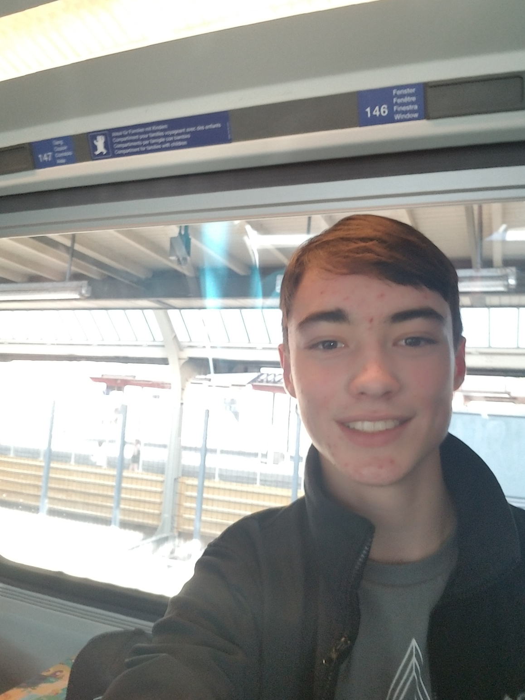

#<ins>About Me</ins>
 

Hi, my name is Mitchell Butler, and I'm so excited to be on GitHub! 
####[My LinkedIn](https://www.linkedin.com/in/mitchell-b-a61658139/)
##Resume

####Education
2018 - 2019 - *__California State University, Sacramento__* - Sacramento, CA

    *Object oriented programming
    *Mathematics: College Algebra, Precalculus, Calculus I
    *Humanities: World Religion, Art History, etc.
    *Philosophy: Critical Thinking, Intro to Philosophy, etc.
    *Communication Studies

2018 &nbsp;&nbsp;&nbsp;&nbsp;&nbsp;&nbsp;&nbsp;&nbsp;&nbsp;&nbsp;&nbsp; - __High School Diploma__ - *Sage Creek High School* - Carlsbad, CA
 
    *AP U.S. History
    *AP Government
    *AP Psychology
    *Member of The Financial Literacy Club
    
2017 - 2018 = *__MiraCosta College__* - Oceanside, CA
    
    * Introduction to Computer Programming
    * Digital Photography
####Work History

    *Legoland California Resort (2016-2018)

